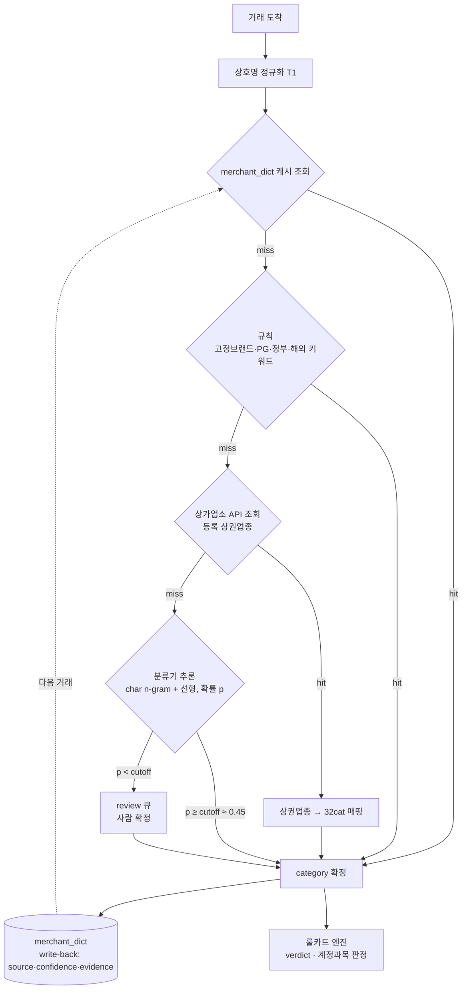

# 업종(카테고리) 분류 아키텍처 제안

카드 상호명을 32개 지출 카테고리로 분류하는 새 구조 제안이다.
근거 수치는 [REPORT.md](REPORT.md)의 실험 결과를 따른다.

## 한 줄 요약

여러 소스를 **정확한 것부터 순서대로** 태우고, 각 단계가 놓친 잔여분만 다음 단계로 넘긴다.
결과는 캐시에 저장해 다음부터는 즉시 조회(hit)한다. 확률적 추론(분류기)은 맨 뒤 폴백이고,
저확신은 사람에게 보낸다. verdict(경비 판정)는 이 흐름과 분리해 룰카드 엔진이 담당한다.

## 제안 파이프라인

## 단계별 설명

| 단계 | 하는 일 | source 태그 | 특성 |
|---|---|---|---|
| 정규화 | 지점명·카드사 태그 제거, 트랙 결정 | - | 결정적 |
| 캐시(`merchant_dict`) | 이미 해소된 상호 즉시 반환 | (원출처 유지) | O(1), 대부분 여기서 끝 |
| 규칙 | 고정 브랜드·PG·정부·해외 키워드 | `rule` | 결정적, 고정밀(0.95) |
| 상가업소 API | 등록 상권업종 직접 조회 | `api` | 조회(추론 아님), 오프라인만 |
| 분류기 | 학습 기반 추론 + 확률 | `model` | 롱테일 폴백, 확률적 |
| review | 저확신·미해소를 사람이 확정 | `user` | 학습 데이터 생성 |
| write-back | 결과를 캐시에 저장 | - | hit/miss 학습 루프 |

## 왜 이 순서인가

1. **정확한 것부터.** 캐시·규칙·API는 결정적이거나 등록정보 조회라 추론오차가 없다.
   분류기(확률 추론)는 이들이 다 놓친 잔여분에만 쓴다. 감사 가능성과 재현성이 앞단에서 유지된다.
2. **외부 API는 잔여분에만.** 매 거래 실시간 호출은 지연·쿼터·비용·프라이버시·비결정성 문제가 있다.
   캐시·규칙 뒤에 두고, 받아온 업종은 write-back해 다음부터 캐시 hit으로 만든다.
3. **저확신은 review.** 분류기가 자신 없는 예측(주로 학습에 없던 온라인·해외 분포)은 확률이 낮게
   나오므로, cutoff로 잘라 정밀도 목표를 지킨다(현 데이터 knee ≈ 0.45, 정밀도 0.96 / 자동화 77%).
4. **verdict 분리.** 이 흐름은 category(입력 특성)만 정한다. 경비 가능/불가와 계정과목은 법령
   인용·감사가 걸려 있어 룰카드 엔진이 결정한다. 확률모델을 verdict에 넣지 않는다.

## 근거 (요약, 상세는 REPORT.md)

- 실제 카드셋(명확 60건)에서 규칙 단독 정확도 0.60 → 하이브리드 0.82, 커버리지 63% → 100%.
- 규칙이 놓친 롱테일의 59%를 분류기가 자동 분류.
- confidence cutoff ≈ 0.45에서 정밀도 0.96 / 자동화 77%.

## 외부 API 소스

| 소스 | 반환 | 우리 구조 적합도 | 한계 |
|---|---|---|---|
| 소상공인 상가업소 조회 OpenAPI | 상호명 → 상권업종(대10·중75·소247) | **최적**: 기존 매핑 재사용, 공공데이터라 저장 제약 적음 | 오프라인 등록점포만 |
| 카카오 로컬 키워드 장소검색 | 상호명 → category_name / category_group_code(18종) | 보조: 도메인 근접 | 오프라인 POI만, 결과 캐싱 ToS 확인 필요 |
| 네이버 지역검색 | 상호명 → category | 보조 | 결과 최대 5개, 오프라인만 |
| 국세청 사업자등록 상태조회 | 사업자번호 → 휴폐업/과세유형 | 부적합: 업종 안 줌, 번호 선행 필요 | - |

카카오/네이버를 쓰면 그 category 체계 → 32cat 매핑표가 별도로 필요하다. 상가업소 API는
상권업종 체계라 이미 만든 `mapping.py`를 그대로 쓴다.

## 도달 범위

분류기·상가 API가 낼 수 있는 카테고리는 32개 중 오프라인 소비 **17개**다. 나머지 15개
(온라인쇼핑·해외SaaS·구독·조세·과태료·PG_미상 등)는 데이터 문제가 아니라 성격이 달라
**키워드 규칙**이 담당한다. 상세는 REPORT.md 참고.

## 고려사항

- **프라이버시**: 캐시에 실카드 상호가 쌓인다. `merchant_dict.user_id` 스코프 유지, 외부 API로
  상호를 보내는 범위를 잔여분으로 최소화, API 결과 저장은 각 서비스 ToS 확인.
- **감사**: 모든 확정에 `source`(rule/api/model/user)와 `confidence`를 기록해 "왜 이 카테고리?"에
  답할 수 있게 한다(스키마에 이미 칸 있음).
- **학습 루프**: review·저확신·사람교정 로그가 다음 학습 데이터이자 규칙 보강 백로그다.

## 다음 단계

1. 실카드 상호 라벨 ~250개로 3-way 비교와 cutoff 재측정(현재 n=92는 방향만).
2. 상가업소 API 실제 호출 스펙(파라미터·인증·응답) 확인 후 조회 어댑터 초안.
3. API 결과 캐싱 ToS 검토(상가업소 vs 카카오/네이버).
4. `merchant_dict` write-back 경로와 분류기 호출 지점을 백엔드에 연결.
